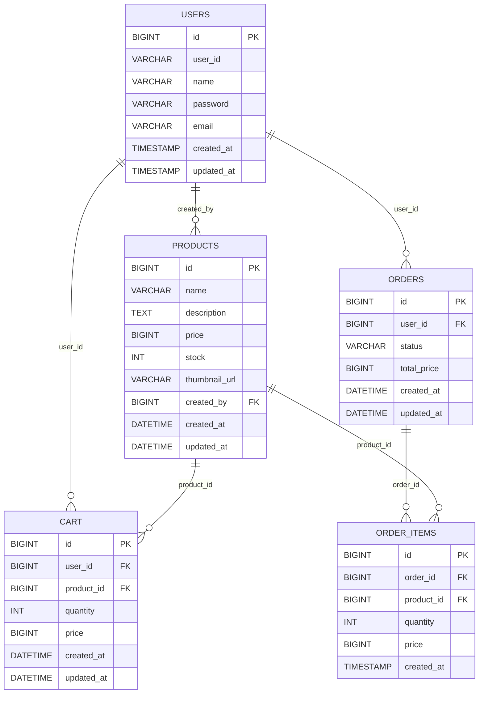
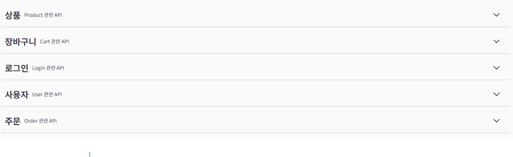
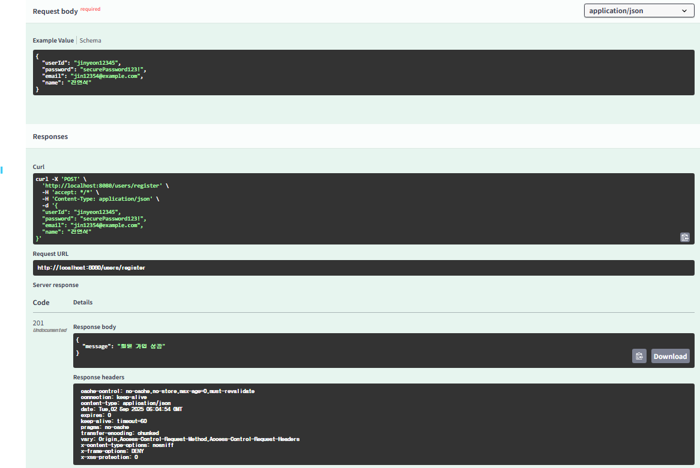
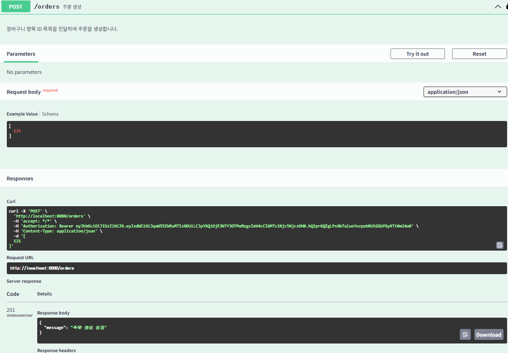
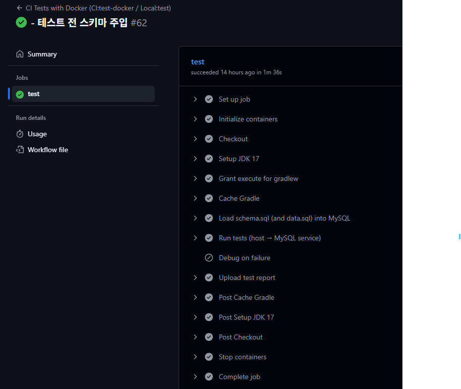

# 🏕️ Gear4Camp API

JWT 기반 사용자 인증, 상품 관리, 장바구니, 주문 기능을 제공하는 **캠핑용품 쇼핑몰 백엔드 API** 프로젝트입니다.  
**Spring Boot + MyBatis + JWT + Docker + GitHub Actions** 기반으로 구현되었으며, CI 자동화 테스트 환경까지 구축했습니다.

---

## 🚀 Tech Stack

- **Language/Framework**: Java 17, Spring Boot 3.2
- **Persistence**: MyBatis, MySQL 8.0
- **Auth**: JWT (Spring Security)
- **Infra/DevOps**: Docker, Docker Compose, GitHub Actions
- **Docs**: Swagger (Springdoc OpenAPI 3.0)
- **Build Tool**: Gradle 8.x

---

## ✨ Features

- **사용자(User)**
    - 회원가입 / 로그인 / 내 정보 조회·수정·삭제
- **상품(Product)**
    - 상품 등록 / 조회 / 삭제
    - 등록 시 `createdBy`(사용자 ID) 저장
- **장바구니(Cart)**
    - 상품 담기 (중복 시 수량 증가)
    - 장바구니 항목 조회 / 수량 수정 / 삭제
    - 가격(`price`)은 서버에서 Product 기준으로 주입 (보안 강화)
- **주문(Order)**
    - 주문 생성 → 주문 항목(OrderItems) 자동 생성
    - 주문 전체 조회 / 단건 조회
    - 주문 취소(`status = CANCELLED`)
- **인증/보안**
    - JWT 기반 인증/인가
    - `/auth/**` 경로만 공개, 나머지는 토큰 필수

---

## 🗂 ERD

아래는 Gear4Camp 프로젝트의 데이터베이스 구조입니다.


## ⚙️ How to Run

### 1) Local (Test Profile)
```bash
# MySQL 실행
docker compose -f docker-compose.test.yml up -d mysql-test

# Spring Boot 실행
./gradlew bootRun --args='--spring.profiles.active=test'
```

### 2) GitHub Actions (CI, test-docker Profile)
- GitHub Actions가 서비스 컨테이너(MySQL) 를 띄우고
- 호스트에서 Gradle 테스트 실행:
```bash
./gradlew test -Dspring.profiles.active=test-docker
```

## 📑 API Docs (Swagger)

Swagger UI 자동 문서화 적용
- 로컬 실행 후 접속: [http://localhost:8080/swagger-ui.html](http://localhost:8080/swagger-ui.html)

예시 화면:

### Swagger 메인


### 회원가입


### 주문생성


## 🛠 CI/CD

- **CI**: GitHub Actions
    - main/dev 브랜치 푸시 시 자동 실행
    - 서비스 컨테이너(MySQL) 구동 → 통합 테스트 실행
- **CD**: Docker 기반 빌드 (배포는 옵션, 현재는 포트폴리오 목적)

### CI 성공


## 📚 Lessons Learned

- `.permitAll()`을 줘도 JWT 필터에서 예외처리 없으면 막히는 구조라는 점 학습
- CI/CD 중 **localhost vs 127.0.0.1 네트워크 이슈** 직접 해결
- Exit 137(OOM) 문제 → JVM/DB 메모리 최적화로 해결
- MyBatis `sqlSessionTemplate` 누락 → 테스트 실패 → 올바른 Bean 설정 필요
- **보안 원칙**: 클라이언트 입력값(가격 등)은 신뢰하지 않고 서버에서 조회·주입

## 🏁 마무리

본 프로젝트는 **2년 11개월차 Java 백엔드 개발자**의 복귀 준비 포트폴리오로 제작되었습니다.  
**실무와 유사한 CI/CD 파이프라인 경험**, 문제 해결 과정을 통한 성장까지 기록한 프로젝트입니다.  